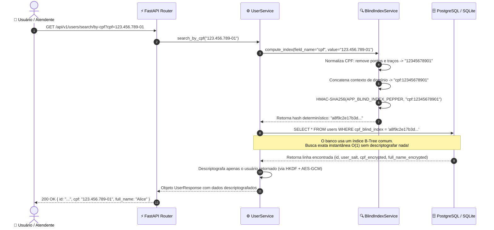

# Diagrama de Sequência: Busca Cega em O(1) via Blind Index

> **Como a API busca um paciente por CPF sem descriptografar o banco e sem expor o CPF em texto plano.**

```mermaid
sequenceDiagram
    autonumber
    actor Cliente as 📱 Usuário / Atendente
    participant API as ⚡ FastAPI Router
    participant Srv as ⚙️ UserService
    participant Blind as 🔍 BlindIndexService
    participant DB as 🗄️ PostgreSQL / SQLite

    Cliente->>API: GET /api/v1/users/search/by-cpf?cpf=123.456.789-01
    API->>Srv: search_by_cpf("123.456.789-01")

    Srv->>Blind: compute_index(field_name="cpf", value="123.456.789-01")
    Blind->>Blind: Normaliza CPF: remove pontos e traços -> "12345678901"
    Blind->>Blind: Concatena contexto de domínio -> "cpf:12345678901"
    Blind->>Blind: HMAC-SHA256(APP_BLIND_INDEX_PEPPER, "cpf:12345678901")
    Blind-->>Srv: Retorna hash determinístico: "a8f9c2e17b3d..."

    Srv->>DB: SELECT * FROM users WHERE cpf_blind_index = 'a8f9c2e17b3d...'
    Note over Srv,DB: O banco usa um índice B-Tree comum.<br/>Busca exata instantânea O(1) sem descriptografar nada!
    DB-->>Srv: Retorna linha encontrada (id, user_salt, cpf_encrypted, full_name_encrypted)

    Srv->>Srv: Descriptografa apenas o usuário retornado (via HKDF + AES-GCM)
    Srv-->>API: Objeto UserResponse com dados descriptografados
    API-->>Cliente: 200 OK { id: "...", cpf: "123.456.789-01", full_name: "Alice" }
```
